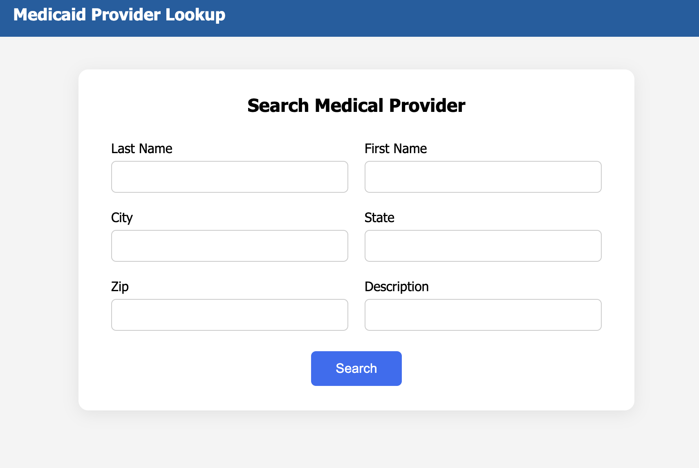
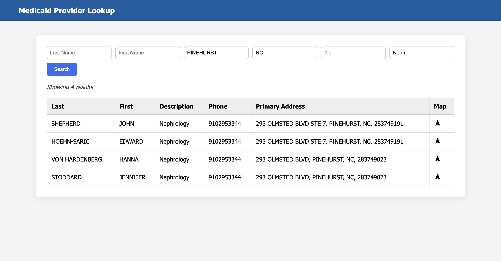
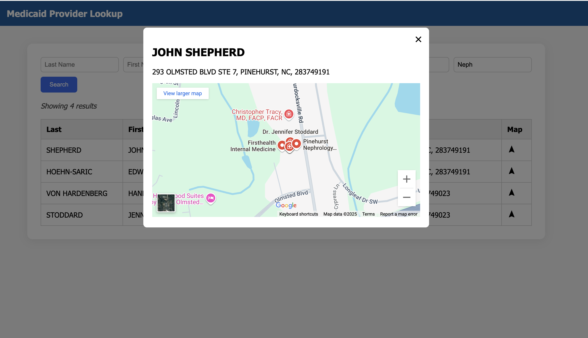

# Provider_Lookup_Project from EMRTS

## Project Overview

Provider Lookup System is a Django-based web application designed to streamline the process of searching and displaying healthcare provider information. The application allows users to perform flexible searches using fields like provider name, location, or taxonomy codes and view detailed information via a dynamic and intuitive interface.

**Data**: Information about all medical providers is found in Monthly NPPES Downloadable File Version 2 (V.2)[https://download.cms.gov/nppes/NPI_Files.html]. Data is then seperated into multiple csv files to be copied into the Postgres Tables.

**Tools**: PostgreSQL was used to maintain data records and the Django framework, implemented in Python, was used to create the backend and frontend of the application.

## Installation

### Prerequisites

- Python 3.11+
- PostgreSQL 17.2+
- uv 0.7.9+

### 1. Clone the repository

```
git clone https://github.com/RandyBrown12/Provider_Lookup_Project.git
cd Provider_Lookup_Project
```

### 2. Create and activate a virtual environment

```
python3 -m venv .venv
source .venv/bin/activate  # On Windows use: .venv\Scripts\activate
```

### 3. Install Dependencies

```
uv pip install -r requirements.txt
```

### 4. Set up the PostgreSQL database

- Create a database (e.g., provider_db)
- Update DATABASES in settings.py with your DB credentials inside of an .env file in the main directory.
- Perform the COPY commands inside the Postgres Shell of your database.
```
\COPY MEDICAL_PROVIDERS(NPI, LAST_NAME, FIRST_NAME, MAILING_STREET, MAILING_CITY, MAILING_STATE, MAILING_ZIP_CODE, PHONE_NUMBER) FROM 
<your_csv_file> WITH (FORMAT csv, HEADER true);
```
```
\COPY TAXONOMIES(TAXONOMY_CODE, TAXONOMY_SPECIALIZATION) FROM 
<your_csv_file> WITH (FORMAT csv, HEADER true);
```
```
\COPY NPI_TO_TAXONOMIES(NPI, TAXONOMY_CODE) FROM
<your_csv_file> WITH (FORMAT csv, HEADER true);
```

## Quick Start

**Create migration files & Apply changes to DB**

```
python manage.py makemigrations
python manage.py migrate
```

**Start the Django development server**

```
python manage.py runserver
```

By default, it starts at http://127.0.0.1:8000

## Application:

It contains of 2 main pages:

- **Search Page**: The search form consists of inputs for Last Name, First Name, City, State, Zip Code, and Description.
- **Result Page**:  It Contains search results for the given parameters along with pagination, sorting as well as navigation capabilities.

## Documentation & API

### Base URL

`http://localhost:8000/api/`

#### GET /search_result/

Search for medical providers based on any combination of the following query parameters: first_name, last_name, city, state, zip_code, description

Example Request:

```
GET /search_result/?first_name=SCOTT&description=Neph
```

## Screenshots

Search Page:

- 

Result Page:

- 

Map Page:

- 
